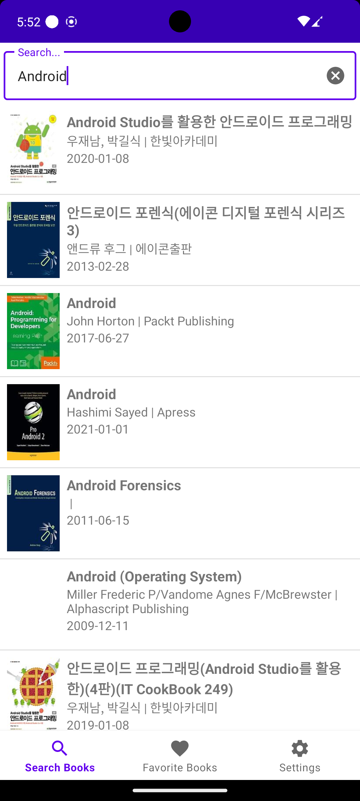

# Book Search Application

### 카카오 책 검색 API를 사용해 책을 검색하는 어플리케이션
<br/>

Jetpack AAC, Modern Android Development를 스터디하며 만든 Jetpack All in One Sample 프로젝트 입니다.


## 🔎 주요 기능 ##

<div style="display: flex; justify-content: space-around; align-items: flex-start;">
  <figure>
    
    <figcaption>책 검색 기능</figcaption>
  </figure>
  <figure>
    
    <figcaption>정보 제공 기능</figcaption>
  </figure>
  <figure>
    
    <figcaption>관심 목록 저장 및 기능</figcaption>
  </figure>
</div>
<br/>

## 📚 프로젝트 설명 ##
```
- Kakao Open Api 중, 도서 검색 api를 사용하여 책을 검색한 후, 이를 보관함에 수집하는 앱입니다.

- 검색은 텍스트가 입력되면 자동으로 수행되며, 결과를 무한 스크롤로 표시합니다.

- UI는 4개의 fragment를 사용합니다(하단 버튼이나 recyclerView item 클릭으로 전환)
    - 첫번째 fragment: 검색 결과
        - 검색어를 입력할 수 있습니다.
        - 입력된 글자를 포함하는 책의 리스트가 나타납니다. 각 아이템은 이미지와 제목, 출판 년도를 포함합니다.
        - 스크롤을 통해 다음 페이지를 불러옵니다.
        - 리스트에서 특정 책을 선택하여 자세한 설명 페이지를 볼 수 있습니다.
    - 두번째 fragment: WebView
        - 책의 상세 페이지를 WebView로 표시합니다.
        - 플로팅 액션 버튼으로 책을 보관하거나 보관함에서 제거할 수 있습니다.
    - 세번째 fragment: 보관함
        - WebView 화면에서 저장한 책을 보관 순서대로 보입니다.
        - 보관한 책 리스트는 내부 DB에 저장됩니다.
    - 네번째 페이지: Setting
        - DataStore를 연습하기 위한 페이지로, 정렬 순서 등의 앱 내부 옵션을 설정할 수 있습니다.
```

## 🛠️ 사용 기술 및 라이브러리 ##

- MVVM Pattern

- Android Jectpack
    - ViewModel
    - ViewBinding
    - LiveData
    - Navigation
    - Room
    - DataStore
    - ViewPager3
      
- Network: Retrofit2, okHttp3

- Image: Glide

- DI: Hilt

- WebView
  
- Kakao open API
  
<br/>

## ‼️ **Troubleshooting** ##

### ViewBinding VS DataBinding

연습을 위해 앱을 구상하던 초기에는 Jetpack을 사용하고, 입력에 따라 새로운 검색 결과를 통해 화면을 계속해서 갱신하는 구조와 RecyclerView ListAdapter를 사용하는 만큼, 자동 UI 업데이트에 유리한 DataBinding을 사용하는 방향으로 생각하고 있었습니다.

하지만 MVVM 아키텍처를 적용하여 UI로직과 비즈니스 로직의 분리를 연습하려는 목적에, DataBinding을 사용하면 오히려 의존성이 높아질 수 있다는 고민을 하게 되었습니다.

결과적으로 간단한 UI로 앱을 만드는 만큼, 단순하게 뷰를 참조하는 방식의 ViewBinding이 적합하다고 판단하게 되었습니다.
