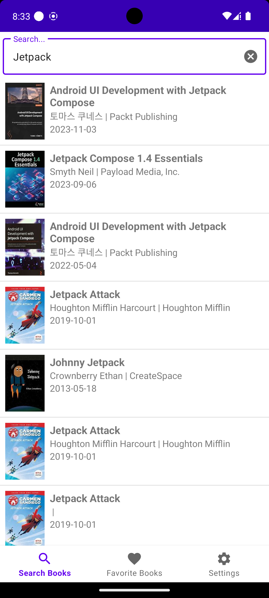

# Book Search Application
### 카카오 책 검색 API를 사용해 책을 검색하는 어플리케이션

## 개요

Jetpack AAC, Modern Android Development를 개인 스터디하며 만든
<br>
Jetpack All in One sample project




## 목표
- Jetpack AAC를 사용한 MVVM 패턴 구현
- Retrofit2를 사용한 REST API 통신
- Room을 사용한 로컬 데이터베이스 구현
- DataStore를 사용한 데이터 저장
- Hilt를 사용한 의존성 주입
- ViewPager3를 사용한 화면 전환
- WebView를 사용한 웹 페이지 표시
- Kakao Open API를 사용한 책 검색
- RecyclerView ListAdapter를 사용한 무한 스크롤 구현
- Navigation을 사용한 화면 전환
- ViewBinding을 사용한 뷰 바인딩
- Paging3를 사용한 데이터 페이징
- Coil을 사용한 이미지 로딩

## 빌드 환경

### Android Studio
- Android Studio Arctic Fox | 2023.1.1 Patch 1
- Build #AI-231.9392.1.2311.11255304, built on December 27, 2023

### Android SDK
- Android SDK Build-Tools 35-rc2
- Android SDK Platform-Tools 34.0.5

### Java
- Java 17

### Kotlin
- Kotlin Version: 1.9.22

### Gradle
- Android Gradle Plugin Version: 8.1.2
- Gradle Version: 8.2.1


## 구성

프로젝트는 Clena Architecture를 기반으로 구성

```agsl
├── BookSearchApplication.kt
├── data
│  ├── api
│  ├── db
│  ├── model
│  └── repository
├── di
├── ui
│  ├── adapter
│  ├── view
│  └── viewmodel
├── worker
└── utils
```

### 1. data
```agsl
├── data
│  ├── api
│  │  └── BookSearchApi.kt
│  ├── db
│  │  ├── BookSearchDao.kt
│  │  ├── BookSearchDatabase.kt
│  │  └── OrmConverter.kt
│  ├── model
│  │  ├── Book.kt
│  │  ├── Meta.kt
│  │  └── SearchResponse.kt
│  └── repository
│     ├── BookSearchPagingSource.kt
│     ├── BookSearchRepository.kt
│     └── BookSearchRepositoryImpl.kt
```
data 디렉토리는 데이터 관련 모든 파일을 포함
Api 호출, 데이터베이스 접근, 모델 정의, 데이터 처리 로직(repository) 포함

- api
  - BookSearchApi.kt: Retrofit2를 사용해 Kakao 책 검색 API를 호출하는 인터페이스 정의
- db
  - BookSearchDao.kt: Room을 사용해 데이터베이스에 접근하는 DAO 인터페이스 정의
  - BookSearchDatabase.kt: Room 데이터베이스 정의
  - OrmConverter.kt: Room 데이터베이스에 저장할 데이터를 직열화/역직렬화 하는 클래스 정의
- model
    - Book.kt: 책 정보를 담는 데이터 클래스 정의
    - Meta.kt: 책 검색 결과 메타 정보를 담는 데이터 클래스 정의
    - SearchResponse.kt: 책 검색 결과를 담는 데이터 클래스 정의
- repository
    - BookSearchPagingSource.kt: Paging3에서 데이터를 가져오는 PagingSource 정의
    - BookSearchRepository.kt: 책 검색 데이터를 가져오는 Repository 인터페이스 정의
    - BookSearchRepositoryImpl.kt: 책 검색 데이터를 가져오는 Repository 구현체 정의

    
### 2. di
```agsl
├── di
│  └── AppModule.kt
```
di 디렉토리는 의존성 주입을 위한 Dagger Hilt 모듈을 포함

- AppModule.kt: 앱 전체에서 사용하는 의존성 주입 모듈 정의

### 3. ui

Presentation Layer로 사용자 인터페이스와 상호작용하는 코드를 포함
<br>
자세한 구조 설명은 생략

### 4. utils

앱 전역에서 사용하는 유틸리티 클래스를 포함
<br>
자세한 구조 설명은 생략

### 5. worker

백그라운드에서 실행되는 작업을 포함

```agsl
├── worker
│  └── CacheDeleteWorker.kt
```
- CacheDeleteWorker.kt: 캐시 삭제 작업을 수행하는 Worker 정의

## 기능 목록

### 1. 책 검색
- 책 검색 API를 사용해 책을 검색
- 검색 결과를 리스트로 표시
- paging3을 사용해 무한 스크롤 구현

‣ 사진 추가 예정

### 2. 책 상세 정보
- 책을 클릭하면 상세 정보를 표시
- WebView를 사용해 상세 정보를 웹 페이지로 표시

‣ 사진 추가 예정


### 3. 북마크
- 책을 북마크하면 로컬 데이터베이스(Room)에 저장
- 북마크한 책은 북마크 탭에서 확인 가능

‣ 사진 추가 예정